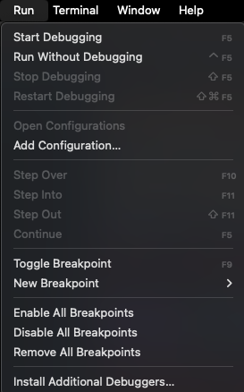
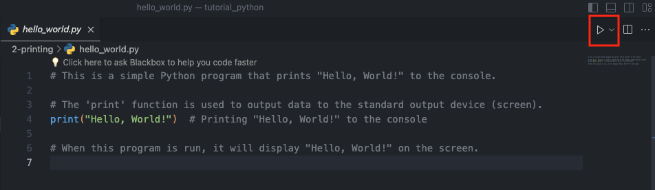
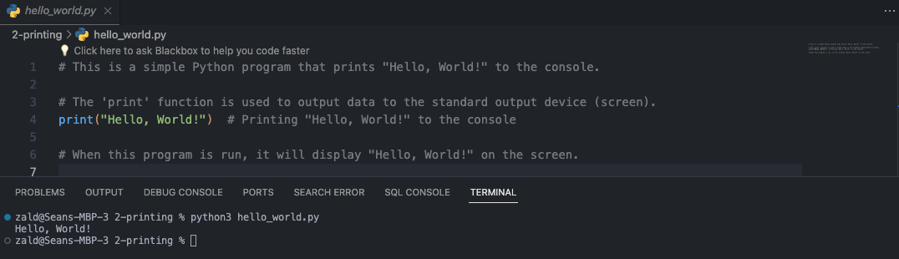

# Introduction to Programming

## Why Should We Learn How to Code?

Learning to code is an valuable skill in the modern world offering numerous benefits, including the ability to:

- **Increase Productivity**: By automating repetitive and tedious tasks, you can save time and focus on more complex problems. Computers excel at handling these kinds of tasks efficiently.

## The Power of Computers in Handling Tasks

Computers are designed to excel at performing repetitive and tedious tasks without the errors and fatigue that can affect human performance. By learning to code, you can harness this power to improve efficiency in various aspects of work and life.

## How to Get Started with Programming

Getting started with programming involves a few key steps:

1. **Have a Computer**: A basic computer is sufficient to start learning programming. It doesn't need to be very powerful for most beginner-level tasks.
2. **Choose an IDE (Integrated Development Environment)**: An IDE is a software application that provides comprehensive facilities to computer programmers for software development. Some popular IDEs for Python include PyCharm, Visual Studio Code, and Jupyter Notebooks.
3. **Pick a Programming Language**: For beginners, Python is highly recommended due to its simplicity and readability. It's a versatile language used in various fields like web development, data science, automation, and more.

## How to Get Python

Python can be downloaded and installed from its official website, [python.org](https://www.python.org/). Choose the version that is appropriate for the operating system and follow the installation instructions provided on the site.

## Starting to Write Code

Once Python and an IDE are installed, you can start writing code. Open the chosen IDE, create a new file, and start typing Python code into it.

## Running a Program

To run a Python program, you'll typically use the run command in the IDE. This command can usually be found in the IDE's toolbar or menu. After writing the code, simply click the run button. You can navigavit to this run button multiple ways.

Run > Run Without Debugging 

You can also click the play/run icon. (Usually loacated in the upper right or the IDE)

Another way to execute the program is by writing the command `python <file name>.py` in the terminal, and the program will execute, showing the output in a console or output window of the IDE.

For example if the file name is main.py to run the file you input the command `python main.py`
If this command doesn't work try `python3 main.py`

### Important Note

- When the Python file is located inside a directory, you must navigate to that directory using the command line or terminal before you can run the file. 
- To navigate to the folder where the Python file is located, you use the cd (change directory) command. Here's how you do it:

1. Open the Terminal or Command Prompt
2. Locate the Python File: Find out where the python file is located.
3. Use the `cd` in the terminal to navigate to the file

