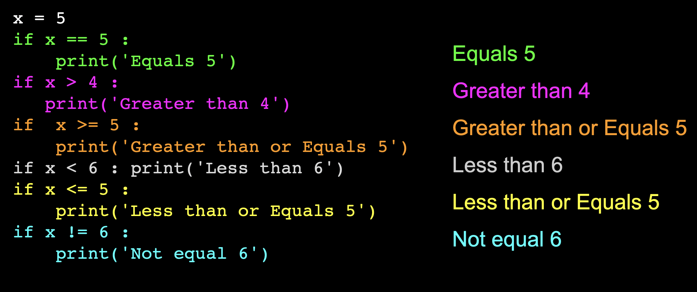
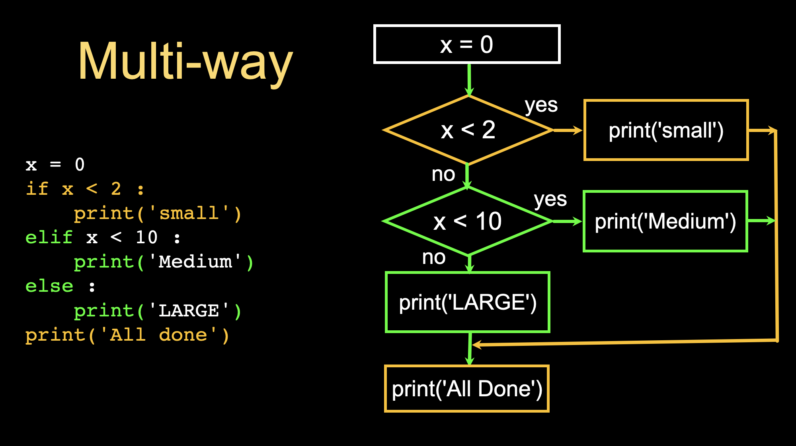
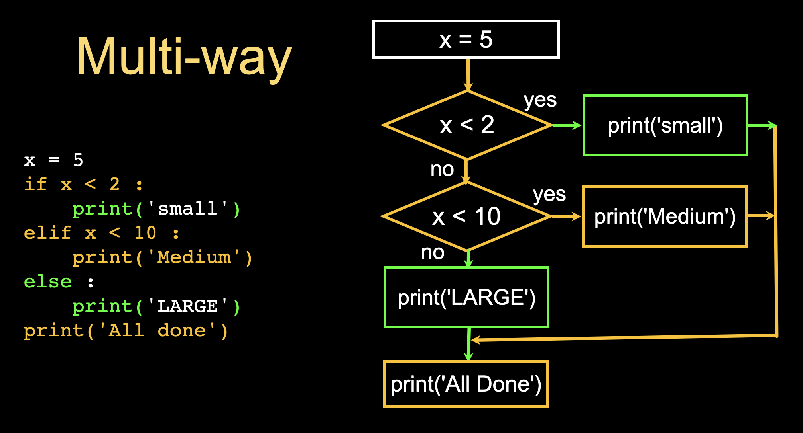
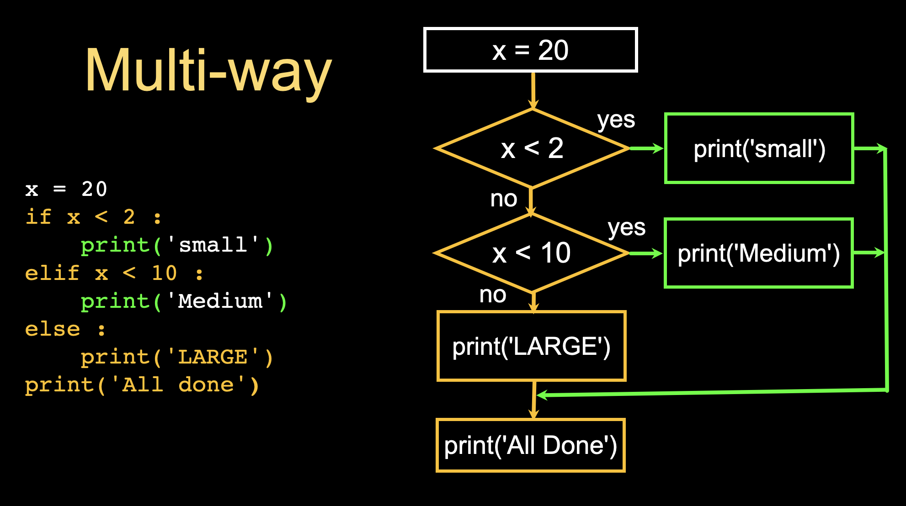

# If Conditions in Python

## Introduction to If Conditions

"If conditions," also known as "conditional statements," are a fundamental concept in programming. These conditions allow a program to execute certain code blocks based on whether a specified condition is true or false.

## What is an If Condition?

- **Definition**: An if condition tests a specific condition (e.g, 4` < 5`) and executes a block of code if that condition is true.
- **Syntax in Python**:
  ```python
  if condition:
      # code to execute if the condition is true
  ```

* **Example**:  
    ```python
    if 4 < 5:
        print("The 5 is greater than 4") 
    ```````
### Indentation
Indentation in Python plays a crucial role in defining the structure and flow of code, particularly with control structures like if conditions. In the given example above, indentation is essential for several reasons:

1. **Defining the Scope:** In Python, indentation specifies which statements are part of the if condition and which aren't. The indented block under the if statement (print("5 is greater than 4")) is executed only if the condition (4 < 5) is true. Without proper indentation, Python would not be able to determine the [scope](./) of the condition.

2. **Syntax Requirement:** Unlike many other programming languages that use braces {} to define a block of code, Python uses indentation. It's a syntax requirement in Python. If the code under the if condition is not indented, Python will throw an IndentationError, indicating that the code's structure is incorrect.


## Why Use If Conditions?

1. **Decision Making**: They enable your program to make decisions based on data or user input. This is crucial for handling different scenarios within your program.
2. **Control Flow**: They help in controlling the flow of execution in a program, allowing different code to run under different conditions.
3. **Increased Flexibility**: They allow your program to respond differently to varying inputs or situations, making your code more flexible and dynamic.

## How Does a Computer Read an If Condition?

1. **Evaluation of Condition**: The computer evaluates the condition in the if statement.
2. **Boolean Value**: The condition is boiled down to either `True` or `False`.
3. **Execution**: If the condition is `True`, the computer executes the code block under the if statement. If it is `False`, the computer skips that block.
- if condition True do something
- if condition False do something else



## Example: Simple If Condition

**Example 1**
````python
# Checking if a number is positive
number = 5
if number > 0:
    print("The number is positive.")
```````

In this example, the program checks if `number` is greater than 0. Since 5 is greater than 0, it prints "The number is positive."

**Example 2**
````python 
number = 4
if number % 2 == 0:
    print("Even")

```````
 The condition in the `if` statement checks if the remainder of `number` divided by 2 is equal to 0 using the modulo operator `%`. Since `number` is 4, the operation number % 2 equals 0. Therefore, the condition `number % 2 == 0` evaluates to True, printing the statement `Even`.


## Adding Else and Elif

- **Else**: An else statement follows an if statement and is executed if the if condition is false.
  ````python
  if condition:
      # code if condition is true
  else:
      # code if condition is false
  ```````


- **Example**
    ````python 
    number = 5
    if number % 2 == 0:
        print("Even")
    else:
        print("Odd")
    ```````
    The `if` statement evaluates the condition `number % 2`, which results in 1 for the number 5, as 5 divided by 2 leaves a remainder of 1. Since this evaluation yields a result that is not equal to 0, the condition is false, prompting the program to execute the else block of code, which prints "Odd".
<br>

- **Elif**: Short for "else if", it allows for multiple conditions to be checked, in order.
  ````python
  if condition:
      # code if first condition is true
  elif another_condition:
      # code if another condition is true
  else:
      # code if no conditions are true
  ```````


## Example: If, Elif, and Else

````python
age = 18
if age < 13:
    print("Child")
elif age < 20:
    print("Teenager")
else:
    print("Adult")
```````

In this example, the program checks multiple conditions and prints "Teenager" because `age` falls into the second category.

# More Examples (follow the orange path)

### Example 1


### Example 2


### Example 3



[Next](./5-challenges.md)


if condition evaluates to True THEN to something

if condtion evaluates to False THEN move to Else