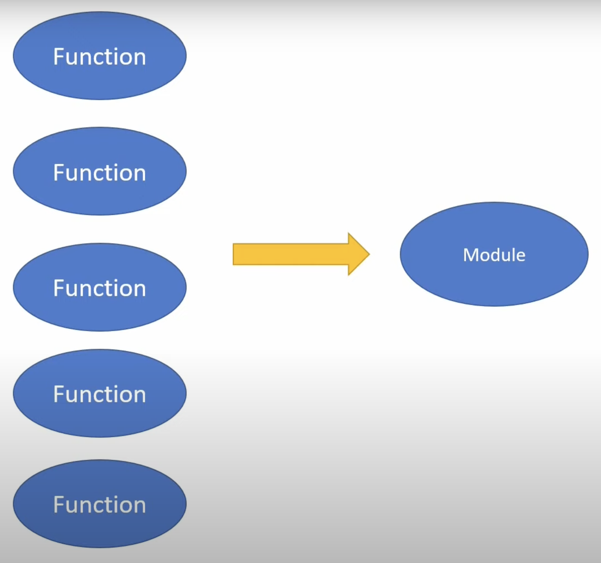
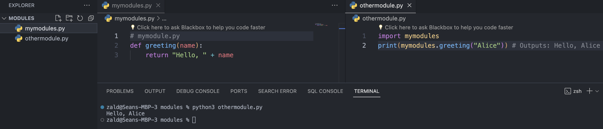

# Python Modules Tutorial for Beginners

## Introduction to Modules

Modules in Python are simply files containing Python code that can define functions, classes, and variables, as well as runnable code. They are essential in organizing and reusing code in larger programs. Think of modules as a collection of functions and variables you have defined.



## Why Use Modules?

- **Code Reusability**: Modules allow you to write code once and use it anywhere by importing the module.
- **Organization**: They help in organizing related code into separate files, making the codebase more manageable and understandable.

## How Are Modules Created?

- **Creating a Module**: Any Python file can be treated as a module. Simply write functions, classes, or variables in a file, and it becomes a module.
- **Example**: Create a file named `mymodule.py` with some functions:
  ```python
  # mymodule.py
  def greeting(name):
      return "Hello, " + name
  ```

## How to Use Modules

- **Importing a Module**: Use the `import` statement to bring a module's functionality into your script.
- **Example**: Using `mymodule.py` in another script.
  ```python
  import mymodule
  print(mymodule.greeting("Alice"))  # Outputs: Hello, Alice
  ```

- **Importing Specific Attributes**: You can choose to import specific functions, classes, or variables from a module.
  ```python
  from mymodule import greeting
  print(greeting("Bob"))  # Outputs: Hello, Bob
  ```




## Creating a Basic Module

1. **Step 1**: Create a Python file (e.g., `util.py`) and write a simple function in it.
   ```python
   # util.py
   def add(x, y):
       return x + y
   ```
2. **Step 2**: In another Python script, import this module and use its function.
   ```python
   import util
   result = util.add(5, 3)
   print(result)  # Outputs: 8
   ```

## Challenge: Module Practice

1. **Create a Conversion Module**: Write a module with functions that convert temperatures between Celsius and Fahrenheit.
2. **Use Your Module**: Import your module in another script and use the conversion functions.


<details>
  <summary>Click For Solution</summary>
  
  ```python
  # main.py
  import conversion
  
  # Convert Celsius to Fahrenheit
  celsius = 25
  fahrenheit = conversion.celsius_to_fahrenheit(celsius)
  print(celsius, "degrees Celsius is equal to", fahrenheit "degrees Fahrenheit.")

  # Convert Fahrenheit to Celsius
  fahrenheit = 77
  celsius = conversion.fahrenheit_to_celsius(fahrenheit)
  print(fahrenheit, "degrees Fahrenheit is equal to", celsius "degrees Celsius.")

  ```

  ```python
  # conversion.py
  def celsius_to_fahrenheit(celsius):
    fahrenheit = (celsius * 9/5) + 32
    return fahrenheit

  def fahrenheit_to_celsius(fahrenheit):
      celsius = (fahrenheit - 32) * 5/9
      return celsius
  ```

</details>