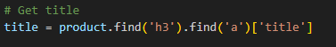

# Webscrape

### Why do people Webscrape?
     To collect **DATA**. The world runs on data. This guy loves your data. 

### How does Webscraping work 

### How do we start?
- 1st need all our tools in order.
    - modules
        - request `#pip install requests`
        - from bs4 import BeautifulSoup `#pip install beautifulsoup4`
- Internet connection
- Pick a website.
    - ex. https://books.toscrape.com/catalogue/category/books_1/index.html

- Decide what data we want to scrape from the website

## Goal of this project
- Get the data of: 
    - Book Title 
    - Rating 
    - Price 
    - Individual Book Link 
    - Number in Stock
- https://books.toscrape.com/catalogue/category/books_1/index.html

Next steps
- provide this data in a visual format that we can send to other people.

    
#Step By Step 

1. Want to specifiy the page we want to scrape. How do we do this? 
-  URL - URL stands for Uniform Resource Locator. A URL is nothing more than the address of a given unique resource on the Web

2. We want to make a request to the website. This is the same as a user typing in the url address clicking search.
- When we make a request. We get a status code back from the server. In this example we are worried about status code 200 (successful) and status code 400 (error or unsuccessful). 

- response has a status code in this example we are going to assume we get a 200 reponse (successful)

3. 

- Next we are going to import the library BeautifulSoup. What is BeautifulSoup used for? 
- This libarry is used to help up navigate through all the html we receive. Why do we want this? We only want specific data from the webpage. (ex. Book title, cost, etc..). 

In the code above we defind soup =  BeautifulSoup(response.text, "html.parser"). It has two parameters. 1st. reponse.text which reprents the HTML content of the webpage we want to parse. 2nd html.parser tells the BeautifulSoup method to parse html content. (other types of content BeautifulSoup can parse is 'lxml')

- Parameter is a variable or value that is passed into a function or method. Think of has passing data

In the varible soup we are storying all the html content from the webpage.

---

4. Next we want to find the a common html element among all the items we want to scrape. 

- Use Inspect element

- Once we find a common element we want to find that elements unique identifier.
    - Each elements has a set of selectors that can help uniquely identifiy them from the rest of the html content. 
    - Examples of this are ids, classes, and classes selectors. Ranking of selectors 
        1. id, 
        2. class 
        3. combination of classes 
        4. element

So what is the common element for our webpage 

---

- findall puts the elements into a list.
- the html structure for each element needs to be the same. 
- **If we get the process right for one element. We can use it acrosss all elements that are the same**
- iterate through the list to specifify 

products is list of all the html elements that have the `class = product_pod`

To access each individual element we use a for loop. 

- product is a variable that represent each individual element (book element) in the list

Find each specific element we want
- Title
- Rating
- Price
- Link
- Stock

### Title 

### Rating

### Price

### Link

### Stock

